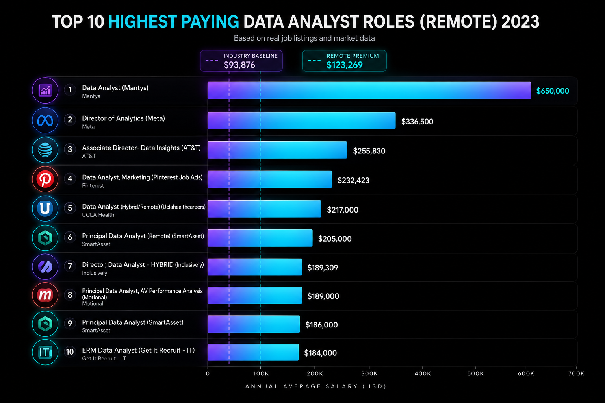

# Introduction
📊 Dive into the data job market! Focusing on data analyst roles, this project explores 💰 top-paying jobs, 🔥 in-demand skills, and 📈 where high demand meets high salary in data analytics. 

This analysis is part of my transition into high-level Data Analytics, aiming to identify strategic opportunities in the global remote market, based in Luke Barousse's SQL courses.

🔍 SQL queries? Check them out here: [project_sql folder](/project_sql/)

# Background
This project was born from a desire to pinpoint top-paid and in-demand skills, streamlining the path to finding optimal roles in the data landscape. By analyzing real-world job postings, I aim to move beyond "administrative analysis" and target high-impact Analytics Engineering positions.

### Data Source
The dataset used for this project comes from [Luke Barousse's SQL Course](https://lukebarousse.com/sql). It provides comprehensive insights into job titles, salaries, locations, and the essential skills required in the industry.

### The questions I wanted to answer through my SQL queries were:
1. What are the top-paying data analyst jobs?
2. What skills are required for these top-paying jobs?
3. What skills are most in demand for data analysts?
4. Which skills are associated with higher salaries?
5. What are the most optimal skills to learn?

# Tools I Used
- **SQL (T-SQL / MS SQL Server):** The backbone of my analysis. I utilized T-SQL for complex queries and data aggregation.
- **Microsoft SQL Server:** My chosen database management system. Opting for SQL Server allowed me to practice industry-standard database administration and high-performance querying.
- **Git & GitHub:** Essential for version control and documenting my progress as a Data Analyst.

### 🛠️ Technical Adaptations (SQL Server vs. PostgreSQL)
To successfully migrate the project from the original PostgreSQL version to SQL Server, I had to implement several key changes:
- **ETL Processes:** Adapted data ingestion methods, specifically utilizing `BULK INSERT` with custom formatting to handle large datasets within the SQL Server environment.
- **Data Types:** Converted boolean logic to comply with SQL Server standards, using `BIT` (0/1) instead of the traditional `TRUE/FALSE` used in PostgreSQL.
- **Syntax Adjustments:** Refactored queries to use T-SQL specific functions like `TOP` for limiting results and specific `CAST/CONVERT` implementations for date formatting.

# The Analysis
Each query for this project investigated specific aspects of the data job market. Here’s how I approached the first question:

### 1. Top Paying Data Analyst Jobs
To identify the highest-paying roles, I filtered Data Analyst positions by average yearly salary and location, focusing exclusively on **remote** jobs. This query highlights the most lucrative opportunities for professionals regardless of their physical location.
```sql
USE data_job_analysis;
WITH top_ten_data_analysis_jobs AS (
	SELECT TOP 10 
		postings.job_id,
		postings.job_title,
		company_dim.name AS company_name,
		postings.job_schedule_type,
		postings.salary_year_avg,
		CAST(postings.job_posted_date AS DATE) as date
	FROM
		job_postings_fact AS postings
	LEFT JOIN
		company_dim ON postings.company_id = company_dim.company_id
	WHERE
		job_location = 'Anywhere' AND
		job_title_short = 'Data Analyst' AND
		salary_year_avg IS NOT NULL
	ORDER BY
		postings.salary_year_avg DESC
)
SELECT
	CAST(
		AVG(top_ten_data_analysis_jobs.salary_year_avg) AS
		DECIMAL (10,2)
		)
FROM
	top_ten_data_analysis_jobs;
-- Total AVG
SELECT AVG (salary_year_avg) FROM job_postings_fact;
-- Data Analyst AVG
SELECT AVG (salary_year_avg) FROM job_postings_fact WHERE job_title_short = 'Data Analyst'
```
### Key Insights from the Data:
- **Massive Salary Ceiling:** Top 10 paying data analyst roles range from **$184,000 to $650,000**, with an elite average of **$264,506**, showcasing the high-income potential of the career.
- **The "Remote Premium":** My analysis indicates that remote Data Analyst roles ("Anywhere") average **$123,268**, providing a **31% salary increase** over the global industry baseline of $93,875.
- **Diverse Employers:** Industry giants like **Meta** and **AT&T** are leading the market alongside Fintech firms like **SmartAsset**, proving that high data-driven value is required across all sectors.
- **Title Specialization:** The variety in job titles (from "Data Analyst" to "Director") suggests that high compensation is closely tied to specialized leadership and strategic decision-making.

<p align="center">
  
</p>
*Bar graph visualizing the salaries for the top 10 remote data analyst roles, including industry and remote average comparisons. This visualization was generated using ChatGPT based on my SQL query results.*

### 2. What Skills are Required for These Top-Paying Jobs?
To understand what skills are prioritized by employers offering the highest salaries, I joined the top 10 job postings with the skills dimension table. This reveals the "Golden Stack" for high-compensation remote roles.

```sql
WITH top_ten_data_analysis_jobs AS (
	SELECT TOP 10 
		postings.job_id,
		postings.job_title,
		company_dim.name AS company_name,
		postings.job_schedule_type,
		postings.salary_year_avg,
		CAST(postings.job_posted_date AS DATE) as date
	FROM
		job_postings_fact AS postings
	LEFT JOIN
		company_dim ON postings.company_id = company_dim.company_id
	WHERE
		job_location = 'Anywhere' AND
		job_title_short = 'Data Analyst' AND
		salary_year_avg IS NOT NULL
	ORDER BY
		postings.salary_year_avg DESC
)
SELECT
	top_ten_data_analysis_jobs.*,
	skills
FROM
	top_ten_data_analysis_jobs
INNER JOIN
	skills_job_dim AS skills_job ON  top_ten_data_analysis_jobs.job_id = skills_job.job_id
INNER JOIN
	skills_dim AS skills ON skills.skill_id = skills_job.skill_id 
ORDER BY
	salary_year_avg
```
### Key Insights:
- **Technical Foundational Duo:** **SQL** (8/10) and **Python** (7/10) remain the undisputed leaders. If you want the big checks, these aren't optional; they are the baseline.
- **Visualization Dominance:** **Tableau** (6/10) appeared significantly more often than Power BI in this specific elite bracket, suggesting a preference for Tableau in high-stakes corporate reporting and Big Tech.
- **Modern Data Stack:** The inclusion of **Snowflake** (3/10) and **Pandas** (3/10) confirms that top-tier analysts are expected to handle cloud data warehousing and advanced data manipulation.
- **The "Business + Tech" Hybrid:** These roles don't just ask for coding. The demand for **R** and **Excel** alongside Python indicates a need for deep statistical analysis coupled with the ability to communicate findings to stakeholders.

<p align="center">
  
</p>
*Bar graph visualizing the skill frequency for the top 10 highest-paying Data Analyst roles. Visualization generated via ChatGPT based on my T-SQL query results.*