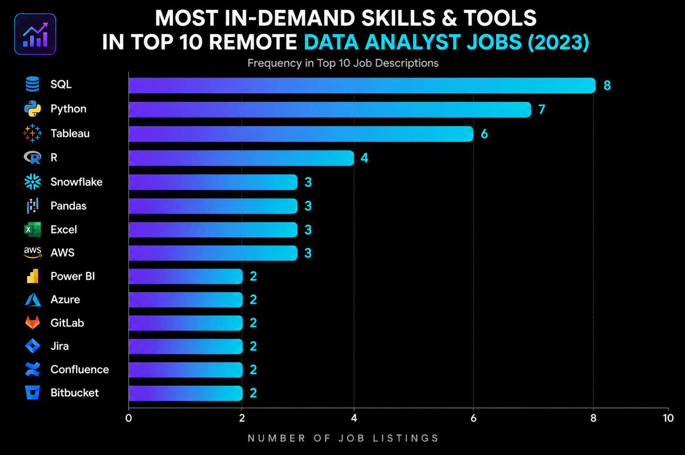
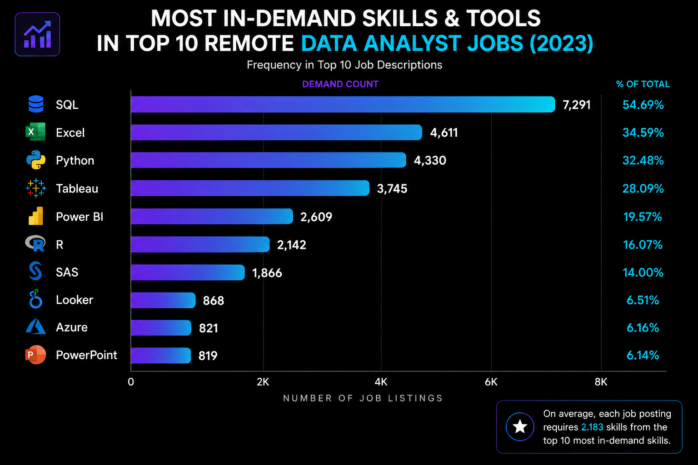
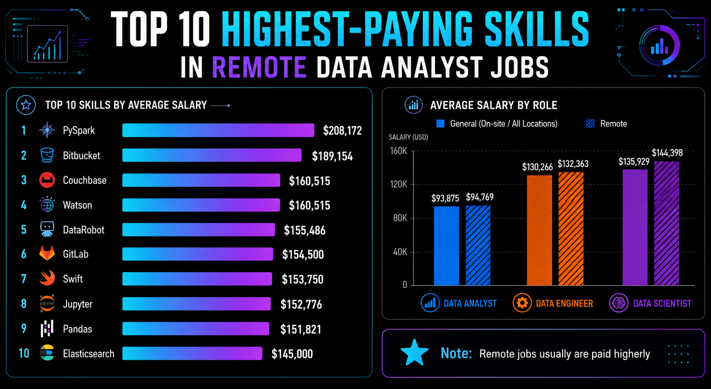

# Introduction
📊 Dive into the data job market! Focusing on data analyst roles, this project explores 💰 top-paying jobs, 🔥 in-demand skills, and 📈 where high demand meets high salary in data analytics. 

This analysis is part of my transition into high-level Data Analytics, aiming to identify strategic opportunities in the global remote market, based in Luke Barousse's SQL courses.

🔍 SQL queries? Check them out here: [project_sql folder](/project_sql/)

# Background
This project was born from a desire to pinpoint top-paid and in-demand skills, streamlining the path to finding optimal roles in the data landscape. By analyzing real-world job postings, I aim to move beyond "administrative analysis" and target high-impact Analytics Engineering positions.

### Data Source
The dataset used for this project comes from [Luke Barousse's SQL Course](https://lukebarousse.com/sql). It provides comprehensive insights into job titles, salaries, locations, and the essential skills required in the industry.

### The questions I wanted to answer through my SQL queries were:
1. What are the top-paying data analyst jobs?
2. What skills are required for these top-paying jobs?
3. What skills are most in demand for data analysts?
4. Which skills are associated with higher salaries?
5. What are the most optimal skills to learn?

# Tools I Used
- **SQL (T-SQL / MS SQL Server):** The backbone of my analysis. I utilized T-SQL for complex queries and data aggregation.
- **Microsoft SQL Server:** My chosen database management system. Opting for SQL Server allowed me to practice industry-standard database administration and high-performance querying.
- **Git & GitHub:** Essential for version control and documenting my progress as a Data Analyst.

### 🛠️ Technical Adaptations (SQL Server vs. PostgreSQL)
To successfully migrate the project from the original PostgreSQL version to SQL Server, I had to implement several key changes:
- **ETL Processes:** Adapted data ingestion methods, specifically utilizing `BULK INSERT` with custom formatting to handle large datasets within the SQL Server environment.
- **Data Types:** Converted boolean logic to comply with SQL Server standards, using `BIT` (0/1) instead of the traditional `TRUE/FALSE` used in PostgreSQL.
- **Syntax Adjustments:** Refactored queries to use T-SQL specific functions like `TOP` for limiting results and specific `CAST/CONVERT` implementations for date formatting.

# The Analysis
Each query for this project investigated specific aspects of the data job market. Here’s how I approached the first question:

### 1. Top Paying Data Analyst Jobs
To identify the highest-paying roles, I filtered Data Analyst positions by average yearly salary and location, focusing exclusively on **remote** jobs. This query highlights the most lucrative opportunities for professionals regardless of their physical location.
```sql
USE data_job_analysis;
WITH top_ten_data_analysis_jobs AS (
	SELECT TOP 10 
		postings.job_id,
		postings.job_title,
		company_dim.name AS company_name,
		postings.job_schedule_type,
		postings.salary_year_avg,
		CAST(postings.job_posted_date AS DATE) as date
	FROM
		job_postings_fact AS postings
	LEFT JOIN
		company_dim ON postings.company_id = company_dim.company_id
	WHERE
		job_location = 'Anywhere' AND
		job_title_short = 'Data Analyst' AND
		salary_year_avg IS NOT NULL
	ORDER BY
		postings.salary_year_avg DESC
)
SELECT
	CAST(
		AVG(top_ten_data_analysis_jobs.salary_year_avg) AS
		DECIMAL (10,2)
		)
FROM
	top_ten_data_analysis_jobs;
-- Total AVG
SELECT AVG (salary_year_avg) FROM job_postings_fact;
-- Data Analyst AVG
SELECT AVG (salary_year_avg) FROM job_postings_fact WHERE job_title_short = 'Data Analyst'
```
### Key Insights from the Data:
- **Massive Salary Ceiling:** Top 10 paying data analyst roles range from **$184,000 to $650,000**, with an elite average of **$264,506**, showcasing the high-income potential of the career.
- **The "Remote Premium":** My analysis indicates that remote Data Analyst roles ("Anywhere") average **$123,268**, providing a **31% salary increase** over the global industry baseline of $93,875.
- **Diverse Employers:** Industry giants like **Meta** and **AT&T** are leading the market alongside Fintech firms like **SmartAsset**, proving that high data-driven value is required across all sectors.
- **Title Specialization:** The variety in job titles (from "Data Analyst" to "Director") suggests that high compensation is closely tied to specialized leadership and strategic decision-making.

<p align="center">
  
</p>

<p align="center">
  <em>Bar graph visualizing the salaries for the top 10 remote data analyst roles, including industry and remote average comparisons. This visualization was generated using ChatGPT based on my SQL query results.</em>
</p>

### 2. What Skills are Required for These Top-Paying Jobs?
To understand what skills are prioritized by employers offering the highest salaries, I joined the top 10 job postings with the skills dimension table. This reveals the "Golden Stack" for high-compensation remote roles.

```sql
WITH top_ten_data_analysis_jobs AS (
	SELECT TOP 10 
		postings.job_id,
		postings.job_title,
		company_dim.name AS company_name,
		postings.job_schedule_type,
		postings.salary_year_avg,
		CAST(postings.job_posted_date AS DATE) as date
	FROM
		job_postings_fact AS postings
	LEFT JOIN
		company_dim ON postings.company_id = company_dim.company_id
	WHERE
		job_location = 'Anywhere' AND
		job_title_short = 'Data Analyst' AND
		salary_year_avg IS NOT NULL
	ORDER BY
		postings.salary_year_avg DESC
)
SELECT
	top_ten_data_analysis_jobs.*,
	skills
FROM
	top_ten_data_analysis_jobs
INNER JOIN
	skills_job_dim AS skills_job ON  top_ten_data_analysis_jobs.job_id = skills_job.job_id
INNER JOIN
	skills_dim AS skills ON skills.skill_id = skills_job.skill_id 
ORDER BY
	salary_year_avg
```
### Key Insights:
- **Technical Foundational Duo:** **SQL** (8/10) and **Python** (7/10) remain the undisputed leaders. If you want the big checks, these aren't optional; they are the baseline.
- **Visualization Dominance:** **Tableau** (6/10) appeared significantly more often than Power BI in this specific elite bracket, suggesting a preference for Tableau in high-stakes corporate reporting and Big Tech.
- **Modern Data Stack:** The inclusion of **Snowflake** (3/10) and **Pandas** (3/10) confirms that top-tier analysts are expected to handle cloud data warehousing and advanced data manipulation.
- **The "Business + Tech" Hybrid:** These roles don't just ask for coding. The demand for **R** and **Excel** alongside Python indicates a need for deep statistical analysis coupled with the ability to communicate findings to stakeholders.

<p align="center">
  
</p>
<p align="center">
  <em>Bar graph visualizing the skill frequency for the top 10 highest-paying Data Analyst roles. Visualization generated via ChatGPT based on my T-SQL query results.</em>
</p>

### 3. In-Demand Skills for Data Analysts

This query identifies the most frequently requested skills in the job market. While the global trend shows a high demand for Python and Tableau, my analysis indicates that core foundations like SQL and Excel remain the absolute baseline for entry.
```sql
-- calculate aggregated demand of skills for Data Analyst & Anywhere
WITH total_jobs_data_analyst_anywhere AS (
	SELECT
		COUNT(*) AS total_demand_count
	FROM
		job_postings_fact
	WHERE
		job_title_short = 'Data Analyst' AND job_location = 'Anywhere'
	),
-- calculate top 10 skills for Data Analyst & Anywhere
tops_skills_demand as (
SELECT TOP 10
	skills_dim.skills,
	COUNT(job_postings_fact.job_id) AS 'Demand Count',
	-- to calculate % we need to multiply the numerator 100 times, and it will be converted into a float number
	-- if you do not do this, SQL will think it's an INT and truncate it to 0
	CAST(ROUND(COUNT(job_postings_fact.job_id) * 100.0 / (SELECT total_demand_count FROM total_jobs_data_analyst_anywhere), 2) AS DECIMAL(5,2)) AS '% of Total'
FROM job_postings_fact
INNER JOIN
	skills_job_dim ON skills_job_dim.job_id = job_postings_fact.job_id
INNER JOIN
	skills_dim ON skills_dim.skill_id = skills_job_dim.skill_id
WHERE
	job_title_short = 'Data Analyst' AND job_location = 'Anywhere'
GROUP BY
	skills_dim.skills
ORDER BY
	[Demand Count] DESC
	)
SELECT * FROM tops_skills_demand
UNION ALL
SELECT 'Top 10 Total', SUM([Demand Count]), SUM([% of Total]/100) 
FROM tops_skills_demand;
```
### Key Insights:
- **The Core Foundation:** **SQL** and **Excel** remain the backbone of remote Data Analyst roles, with 7,291 and 4,611 mentions respectively. This highlights that data extraction, querying, and spreadsheet analysis are still essential skills across the industry.

- **The Visualization Landscape:** On a global scale, **Tableau** (3,745 mentions) shows stronger demand than **Power BI** (2,609) in remote "Anywhere" postings. However, my regional analysis for **Argentina** reveals a different trend, where Power BI (122) surpasses both Excel (118) and Tableau (86), suggesting a stronger adoption of the Microsoft ecosystem in the local market.

- **The Technical Shift:** **Python** ranks as the leading programming language with 4,330 mentions, reflecting the growing expectation for analysts to handle automation, data manipulation, and more advanced analytical workflows.

- **The Market Priority:** The data suggests that mastering the "Big Three" — **SQL, Python, and a BI tool (Tableau or Power BI)** — provides the strongest foundation for visibility and competitiveness in the remote Data Analyst job market.

<p align="center">
  
</p>

<p align="center">
  <em>Demand for the top skills in remote Data Analyst job postings.</em>
</p>

### 4. Skills Based on Salary
This analysis identifies the skills that offer the highest financial reward for remote Data Analyst positions. By crossing **average salary** with **demand count**, we can differentiate between high-specialization niches and industry-standard tools that justify premium pay.

```sql
SELECT TOP 25
	skills_dim.skills,
	ROUND(AVG(salary_year_avg), 2) AS avg_salary,
	COUNT(job_postings_fact.job_id) AS demand_count
FROM
	job_postings_fact
INNER JOIN
	skills_job_dim ON skills_job_dim.job_id = job_postings_fact.job_id
INNER JOIN
	skills_dim ON skills_dim.skill_id = skills_job_dim.skill_id
WHERE
	job_title_short = 'Data Analyst' AND
	salary_year_avg IS NOT NULL AND
	job_work_from_home = 1
GROUP BY
	skills_dim.skills
ORDER BY
	avg_salary DESC;
```

### Key Insights:
* **High Demand for Big Data & ML Skills:** The highest salaries are commanded by analysts proficient in Big Data technologies (**PySpark averaging $208,172**) and Python libraries such as **Pandas ($151,821)** and **NumPy ($143,512)**. The high frequency of the latter suggests that advanced data processing is a core competency for top-paying roles.
* **Software Development & Engineering Crossover:** Proficiency in deployment and version control tools (**GitLab**, **Bitbucket**, **Airflow**) indicates a lucrative intersection between analytics and engineering. These skills facilitate pipeline automation, a capability highly valued by companies operating remotely.
* **Cloud Computing Expertise:** The presence of **Databricks ($141,906)** with 10 mentions, along with **GCP ($122,500)**, underscores that cloud environment proficiency is a fundamental requirement to access upper salary brackets.

<p align="center">
  
</p>

<p align="center">
  <em>Profitability Analysis: Top 10 skills by salary and ecosystem comparison by role.</em>
</p>

### 5. Most Optimal Skills to Learn (High Demand & High Salary)

Combining insights from demand and salary data, this query aimed to pinpoint skills that are both in high demand and have high salaries, offering a strategic focus for skill development.

> **Technical Note:** The following query was originally designed for PostgreSQL but has been **corrected and optimized for SQL Server (T-SQL)**. Key adjustments include using `TOP` instead of `LIMIT`, handling `BIT` data types for booleans (`1` instead of `True`), and ensuring ANSI-standard grouping by including all non-aggregated columns in the `GROUP BY` clause.

```sql
SELECT TOP 25
    skills_dim.skill_id,
    skills_dim.skills,
    COUNT(skills_job_dim.job_id) AS demand_count,
    ROUND(AVG(job_postings_fact.salary_year_avg), 0) AS avg_salary
FROM job_postings_fact
INNER JOIN skills_job_dim ON job_postings_fact.job_id = skills_job_dim.job_id
INNER JOIN skills_dim ON skills_job_dim.skill_id = skills_dim.skill_id
WHERE
    job_title_short = 'Data Analyst'
    AND salary_year_avg IS NOT NULL
    AND job_work_from_home = 1 
GROUP BY
    skills_dim.skill_id,
	skills_dim.skills
HAVING
    COUNT(skills_job_dim.job_id) > 10
ORDER BY
    avg_salary DESC,
    demand_count DESC;
```

| Skill ID | Skills     | Demand Count | Average Salary ($) |
|----------|------------|--------------|-------------------:|
| 8        | go         | 27           |            115,320 |
| 234      | confluence | 11           |            114,210 |
| 97       | hadoop     | 22           |            113,193 |
| 80       | snowflake  | 37           |            112,948 |
| 74       | azure      | 34           |            111,225 |
| 77       | bigquery   | 13           |            109,654 |
| 76       | aws        | 32           |            108,317 |
| 4        | java       | 17           |            106,906 |
| 194      | ssis       | 12           |            106,683 |
| 233      | jira       | 20           |            104,918 |

*Table of the most optimal skills for data analyst sorted by salary*

### Key Insights:
* **High-Demand Programming Languages:** Python and R stand out for their high demand, with demand counts of 236 and 148 respectively. Despite their high demand, their average salaries are around $101,397 for Python and $100,499 for R, indicating that proficiency in these languages is highly valued but also widely available.
* **Cloud Tools and Technologies:** Skills in specialized technologies such as Snowflake, Azure, AWS, and BigQuery show significant demand with relatively high average salaries, pointing towards the growing importance of cloud platforms and big data technologies in data analysis.
* **Business Intelligence and Visualization Tools:** Tableau and Looker, with demand counts of 230 and 49 respectively, and average salaries around $99,288 and $103,795, highlight the critical role of data visualization and business intelligence in deriving actionable insights from data.
* **Database Technologies:** The demand for skills in traditional and NoSQL databases (Oracle, SQL Server, NoSQL) with average salaries ranging from $97,786 to $104,534, reflects the enduring need for data storage, retrieval, and management expertise.

# What I Learned

Throughout this adventure, I've turbocharged my SQL toolkit with some serious firepower:

- **⚙️ Cross-Platform Optimization:** Learned to bridge the gap between different SQL dialects (PostgreSQL and SQL Server), adapting syntax and data types for production-ready code.
- **🧩 Complex Query Crafting:** Mastered the art of advanced SQL, merging tables like a pro and wielding CTEs for ninja-level temp table maneuvers.
- **📊 Data Aggregation:** Got cozy with `GROUP BY` and turned aggregate functions like `COUNT()` and `AVG()` into my data-summarizing sidekicks.
- **💡 Analytical Wizardry:** Leveled up my real-world puzzle-solving skills, turning business questions into actionable, insightful SQL queries.

# Conclusions

### Insights
From the analysis, several general insights emerged:

1. **Top-Paying Data Analyst Jobs**: Remote roles offer massive potential, with some top-tier positions reaching outlier salaries of up to $650,000.
2. **Skills for Top-Paying Jobs**: High-paying jobs demand more than just basic reporting; they require advanced proficiency in SQL and Python.
3. **Most In-Demand Skills**: SQL remains the undisputed king of the job market, making it the non-negotiable foundation for any Data Analyst.
4. **Skills with Higher Salaries**: Niche expertise in tools like **PySpark** or specialized cloud platforms commands a significant pay premium.
5. **Optimal Skills for Job Market Value**: The "Sweet Spot" lies in Cloud Technologies (Azure, AWS) and Big Data tools (Snowflake, BigQuery), where high demand meets high compensation.

### Closing Thoughts

This project not only enhanced my technical SQL skills but also provided a clear roadmap for my career transition. By focusing on high-demand, high-salary skills like those in the **Microsoft Fabric** ecosystem, I can strategically position myself for the European market. The data confirms it: continuous adaptation to emerging cloud trends is the key to maximizing market value in the evolving data landscape.